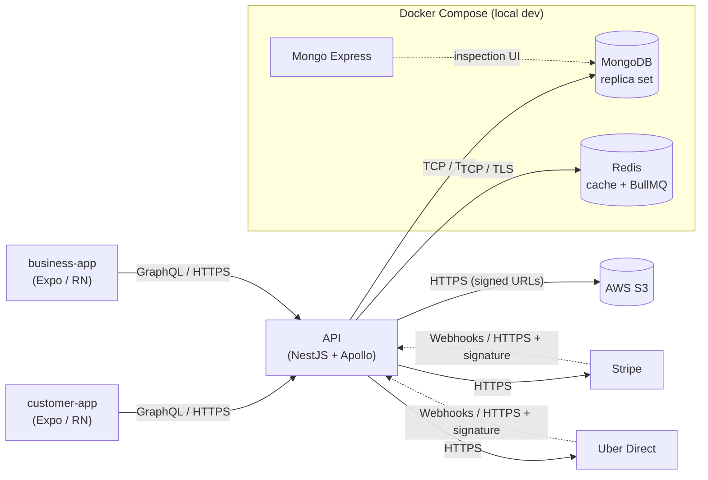

# Architecture

> Personal project, in development. Not yet launched publicly. The shapes below describe how the system is wired today in local dev.

## Overview

Three deployable units: a mobile app for end users, a second mobile app for the account holders (sellers), and a GraphQL API both clients talk to. The two apps share TypeScript conventions (auth handling, request layer, design primitives) but not a package — the audiences have different screens, permissions, and refresh cadences, and collapsing them into one binary would either bloat the bundle or force feature flags everywhere.

The API is the only thing that talks to persistence, cache, blob storage, and the third-party providers. Clients never reach Stripe or the courier provider directly; the server mediates every external call so webhooks, signed URLs, and idempotency live in one place.

## Mobile Clients

Two Expo apps on the same stack: Expo Router for file-based navigation, React Query for server state, Zustand for the thin slice of client state (tokens, local prefs), and `expo-secure-store` for anything sensitive on disk. GraphQL goes over plain HTTP POST via a small `gqlRequest` wrapper — no Apollo client — so React Query is the single cache layer. An Axios instance owns the auth interceptor: on `401` it tries one refresh, retries the original request, and logs the user out on a second failure. Both apps target iOS and Android from one codebase and build through EAS.

## API Layer

NestJS with Apollo in code-first mode, so every GraphQL type comes from a TypeScript class with decorators — no hand-written SDL. Resolvers stay thin: validate input with `class-validator`, call a domain service, return. Business logic lives in services; services depend on Mongoose models. Auth, rate limiting, request logging, and error shaping compose as NestJS guards/interceptors at the resolver boundary. An internal event emitter decouples side effects — a service emits `order.created`, and listeners for email, push, and analytics handle it independently of the request lifecycle.

## Primary Data Store

MongoDB via Mongoose. Documents use ObjectIds as primary keys, timestamps are managed by Mongoose, and every user-facing collection carries an `active: boolean` flag so "delete" is a soft operation — history stays queryable and accidental deletes are recoverable without a restore. Geo reads (nearby lookups, radius filters) hit a `2dsphere` index on the Account location field. Replica-set mode runs even in local dev so transactions, change streams, and causal consistency behave the same way they would in production. Indexes are declared next to the schema rather than in a separate migration folder.

## Hot Path, Cache and Queues

Redis plays two roles. First, key/value cache for read-heavy, low-churn data (catalog slices, aggregates, session-scoped flags) with short TTLs and explicit invalidation on writes. Second, the transport for BullMQ, which runs background work: outbound emails, push dispatch, webhook fan-out, scheduled recomputes, and retries for flaky third parties. Pushing slow or failure-prone work behind a queue keeps the GraphQL request budget predictable and gives me attempts/delays/dead-letter visibility for free. Workers run in the same NestJS process locally; they can be split into their own container later without code changes.

## Blob Storage

Uploads (profile images, product photos, user-generated media) live in AWS S3. The client never sees AWS credentials: it asks the API for a short-lived signed PUT URL, uploads directly to S3, and reports the resulting key back. The API validates ownership and records the `Upload` in Mongo with size, content-type, and the S3 key — never the URL itself. Reads go through signed GET URLs too, so assets stay private by default and can be rotated or revoked without rewriting records. Large binary transfer never hits the API node.

## Payments

Stripe handles checkout, subscriptions, and payment methods. The API creates Stripe Customer objects lazily on first purchase and stores the mapping on the `Account`. Hosted card forms go through Stripe Checkout. Webhooks come back over HTTPS with a signing secret; a dedicated controller verifies the signature, dedupes by event ID, and hands the event off to a BullMQ job that updates the local `Subscription` or `Payment`. The client's "payment succeeded" is never trusted — the webhook is the source of truth, and the mobile UI polls the API until the server state flips.

## Last-Mile Delivery

For same-day delivery the API integrates with Uber Direct. Flow: the client requests a quote, the API calls Uber Direct with pickup/drop-off coordinates, stores the quote with a short TTL, and returns it. On confirmation the API books the delivery, persists the tracking ID, and listens to Uber's status webhooks to progress the local `Order` through `delivering → delivered`. Cancellations go back through the API so refunds, notifications, and audit logs stay consistent. The courier integration sits behind an adapter, so swapping providers would be a service-layer change rather than a schema change.

## Local Dev Footprint

One `docker-compose.yml` brings up MongoDB (configured as a one-node replica set so transactions and change streams work), Redis, and Mongo Express for quick inspection. The API runs on the host with `npm run dev` and connects to the containers on localhost. No setup script beyond `docker compose up -d` and an `.env` file — a fresh clone is a working API in under two minutes.

## System Diagram

*Note: MongoDB, Redis, and Mongo Express run under Docker Compose locally. The plan for production is managed services with the same wire protocol and replica-set shape — same behavior, different hosts.*

## Arrow Legend

Mobile clients talk to the API over GraphQL-on-HTTPS: a POST to `/graphql` with a JSON body, a Bearer token in the `Authorization` header, TLS end-to-end. The API talks to MongoDB and Redis over their native TCP protocols via the official drivers, with long-lived connection pools shared across requests. S3 is reached over HTTPS with the AWS SDK, but end-user uploads and downloads go *directly* from the mobile client to S3 using short-lived pre-signed URLs, so large payloads never traverse the API node. Stripe and Uber Direct are both HTTPS outbound for commands (create checkout, request quote, book delivery) and HTTPS inbound for webhooks; each inbound request carries a provider-specific signature header that the API verifies before touching the payload.
