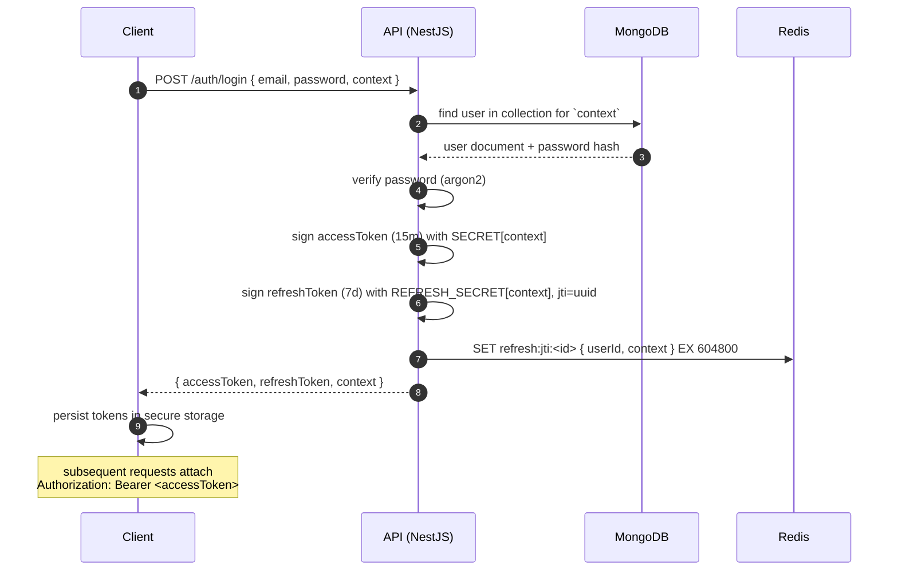
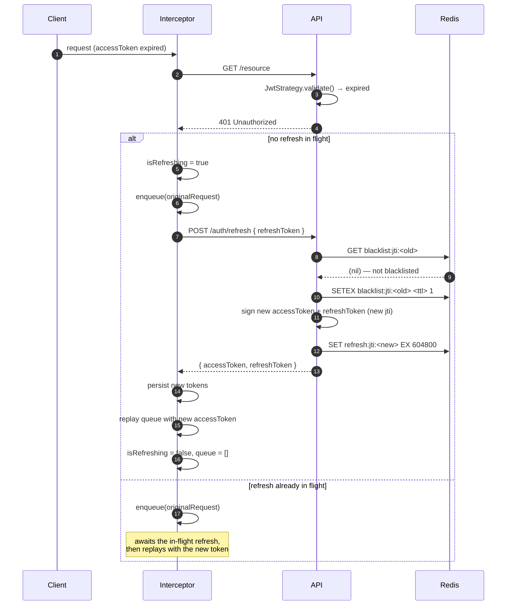

# Authentication Flow

> Personal project, in development. This document describes the auth model as it's implemented in the private codebase.

How the backend isolates auth across three user populations, keeps session state stateless, and how the mobile client avoids the thundering herd of parallel refresh attempts when many queries hit an expired token at the same time.

## 1. Model

The API serves three user contexts, each with its own data boundary, authorization surface, and risk profile:

- **`end-user`** — consumers browsing and purchasing on the marketplace.
- **`tenant-admin`** — account owners running a storefront on the platform.
- **`staff`** — internal operators with privileged tooling access.

Each context is signed with a **dedicated JWT secret**. If one secret leaks, the blast radius is confined to that one slice of the userbase — a staff-secret compromise does not grant tokens against end-user accounts, and vice versa.

Tokens are short-lived: **15 minutes** for the access token, **7 days** for the refresh token. Refresh tokens **rotate on every use**; the old `jti` is blacklisted in Redis with a TTL matching its remaining lifetime. A replayed refresh is detected on the second attempt and invalidates the session immediately.

On the client, a **refresh queue** ensures that N simultaneous 401s collapse into a single refresh round-trip.

---

## 2. Sequence — login



---

## 3. Sequence — access + refresh with queue



> **Failure path.** If the refresh call itself fails — reused token, expired refresh, network error — the interceptor clears both tokens from secure storage, rejects every queued request, and redirects the user to the login screen. There is no retry loop: a failed refresh is a terminal state for the session.

---

## 4. The queue, step by step

A mobile app mounts many screens in parallel. The dashboard alone might fire five queries on first paint: profile, notifications, recent activity, feature flags, and the greeting widget. If the access token has just expired, all five hit the server at the same millisecond and all five receive a 401.

Without a queue, each 401 triggers its own refresh. The first refresh rotates the refresh token and blacklists the old `jti`. The four that lost the race now present an already-blacklisted refresh token — they all fail. The interceptor, seeing refresh failures, logs the user out.

The queue eliminates the race. The first 401 flips an `isRefreshing` flag and becomes the owner of the refresh. Every subsequent 401 sees the flag, parks its original request in a promise queue, and waits. When the single refresh completes, the owner replays every queued request with the new access token and clears the flag. One refresh per expiration, regardless of concurrency.

---

## 5. Multi-context secret selection

`passport-jwt` accepts a `secretOrKeyProvider` callback on the strategy options. It runs **after** the token is decoded but **before** the signature is verified, and it receives both the request and the decoded payload:

```ts
JwtModule.registerAsync({
  useFactory: () => ({
    secretOrKeyProvider: (_req, rawJwtToken, done) => {
      const decoded = jwt.decode(rawJwtToken) as { context?: string } | null;
      const secret = SECRETS[decoded?.context ?? ''];
      if (!secret) return done(new Error('Unknown token context'));
      return done(null, secret);
    },
  }),
});
```

The strategy reads the `context` claim, looks up the matching secret in the env map, and hands it back. An unknown or missing claim returns an error and the guard responds with a clean 401. A single strategy serves all three contexts — no parallel guards, no duplicated validation code.

---

## 6. Revocation via Redis JTI blacklist

Every token carries a `jti` (JWT ID) claim. Two events write to the blacklist:

- **Logout** — `SETEX blacklist:jti:<id> <remaining_ttl> 1` for both the access and the refresh JTIs.
- **Refresh rotation** — the old refresh `jti` is blacklisted the moment the new pair is issued.

The JWT strategy's `validate()` hook checks `EXISTS blacklist:jti:<id>` on every request. It's an O(1) lookup against Redis, adding sub-millisecond latency. The blacklist size scales with **recently revoked** tokens (which expire on their own TTL), not with the active user base — far cheaper than a server-side session store keyed by every logged-in user.

---

## 7. Trade-offs explicitly chosen

- **Stateless access tokens over server-side sessions.** Horizontal scale without sticky sessions or a shared session cache on the hot path. Cost: revocation isn't instant — a stolen access token stays valid until its 15-minute window closes, unless you pay for a blacklist check on every request. I pay it.
- **Rotating refresh tokens over long-lived non-rotating ones.** The second use of a rotated token is a compromised session, and that's detectable. Cost: a short spike in DB and Redis writes when many clients reconnect at once after an outage.
- **Per-context signing secrets over one shared key.** Overhead: three secrets to manage in every environment and rotate independently. Worth it because a leak — misconfigured log sink, compromised CI runner, careless commit — only mints tokens for one population.

---

## 8. What is intentionally not in the diagram

- **MFA and WebAuthn flows.** Out of scope for this case study. They attach to the login step and branch the state machine, but do not change the token model described here.
- **Social OAuth providers.** Also supported by the system, but described only as "also supported" rather than detailed. The provider handshake is tangential to the core multi-context, queued-refresh pattern that this document is about.
