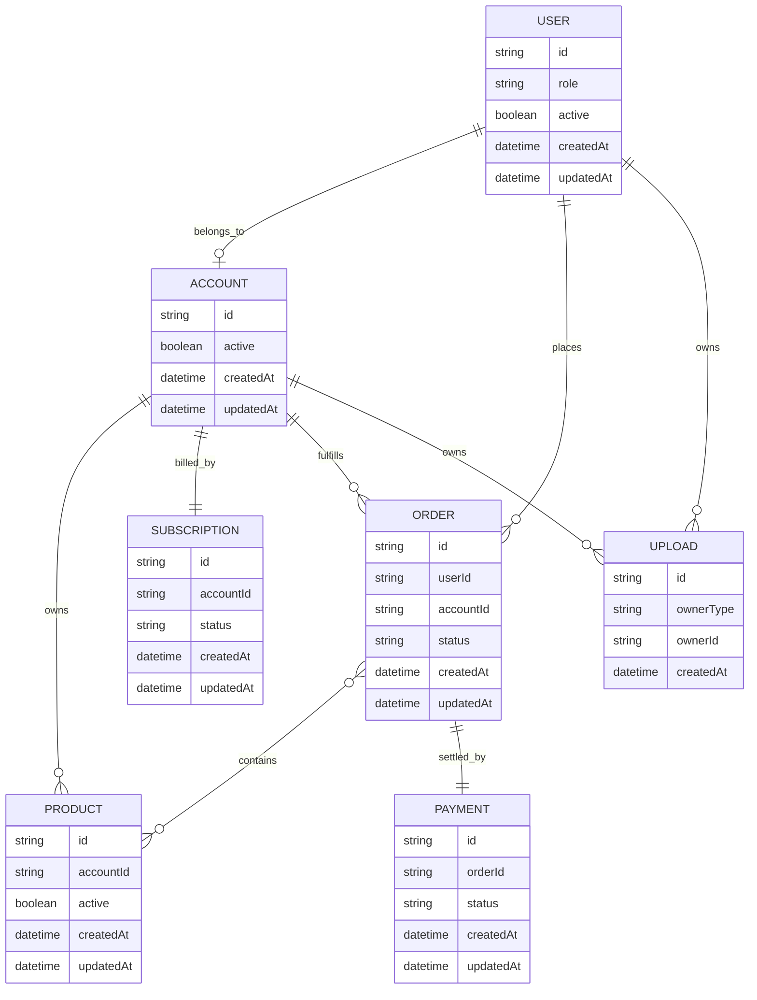

# Data Model

> Personal project, in development. The entities below mirror the shape of the real model in the private codebase.

This document describes the data model at a **conceptual level**. It mirrors the shape of the real system but deliberately stops at the entity/relation boundary — fields are limited to *structural primitives* (`id`, `createdAt`, `updatedAt`, `status`, `ownerId`, `accountId`, `active`) because anything richer would leak product strategy. The concrete implementation runs on **MongoDB** with **Mongoose** schemas, and two patterns show up across every collection: **soft delete via an `active: boolean` flag** (rather than hard `remove()`) so that history stays queryable for disputes, audits, and support flows; and **GeoJSON `Point` fields backed by a `2dsphere` index** so location-aware reads (nearest-account lookups, geo-bounded listings) stay on an index path instead of falling back to collection scans.

## 1. Entities

- **`User`** — a person who signs in. Carries a `role` that governs which endpoints and mutations they can reach. Exists independently of any tenant.
- **`Account`** — a tenant entity (for example, a seller). Zero or more `User`s belong to one `Account`, which owns the catalog published to the marketplace.
- **`Product`** — a listing an `Account` publishes. Has one or more variants and at least one attached media asset.
- **`Order`** — a commitment from a `User` to purchase one or more `Product`s from a single `Account`. Progresses through a status lifecycle from placement to fulfillment.
- **`Payment`** — a processor-agnostic reference to an external payment (id + status + provider), tied to exactly one `Order`.
- **`Subscription`** — a billing entity attached to an `Account`. Gates feature access by tier.
- **`Upload`** — a media reference (S3 key + public URL). Polymorphic owner: can belong to either a `User` or an `Account`.

## 2. Relationships

- `User` **N—1** `Account` — a user belongs to zero or one account.
- `Account` **1—N** `Product` — an account owns many products; a product has exactly one owning account.
- `Account` **1—1** `Subscription` — each account has one billing subscription.
- `User` **1—N** `Order` — a user places many orders over time.
- `Order` **N—N** `Product` — modeled as an embedded `items[]` array inside the order document.
- `Order` **1—1** `Payment` — one order, one payment record.
- Any entity **N—M** `Upload` — uploads are polymorphic: an upload references its owner by `{ ownerType, ownerId }`.

## 3. Entity-Relationship Diagram

## 4. Notes on Indexing

Indexes were added in response to observed query shapes, not guessed up front — this matters because every index is a write-time cost, and the shapes change as the product evolves.

- **`2dsphere`** on `Account.location` (a GeoJSON `Point`) for proximity and radius queries.
- **Compound index** on `Order { userId: 1, createdAt: -1 }` for a user's order history sorted newest-first — the dominant read on the account-holder side.
- **Compound index** on `Product { accountId: 1, active: 1 }` for the tenant's own catalog page, which filters out soft-deleted rows by default.
- **Single-field index** on `Payment.orderId` for webhook reconciliation.
- **TTL index** on short-lived auxiliary collections (sessions, one-time tokens) where applicable.

The rule of thumb: profile the slow query first, then add the index it points to. Indexes added speculatively tend to get stale as access patterns drift.

## 5. What this diagram doesn't show

This is a **structural** view. Business-sensitive fields have been intentionally stripped: pricing and currency handling, commission and fee splits, subscription tier definitions, promotional and discount logic, inventory reservation windows, cancellation and refund rules, and any moderation state on user-generated content. Those live in the real schema, but publishing them here would describe the business model, not the data model. Treat this document as a map of *how entities relate*, not as an implementation spec — the real collections carry meaningfully more shape than what appears above.
