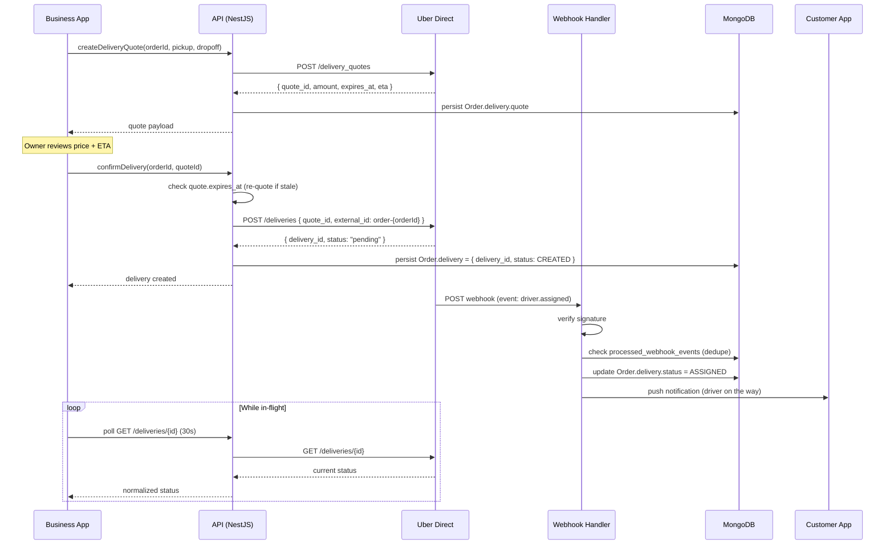

# Delivery Flow — Uber Direct Integration

> Personal project, in development. This document describes the delivery integration as it's implemented in the private codebase.

## 1. Intro

Last-mile delivery is wired through Uber Direct using a **quote-first** pattern: the business-owner app never commits a ride in a single call. It first asks the API for a *quote* (price + ETA window), renders it to the owner, and only triggers a `createDelivery` call after explicit confirmation. Two reasons: (1) the owner sees the real cost before anyone is on the hook for it, and (2) if the quote's TTL lapses mid-review, the backend silently re-quotes rather than billing against a stale number.

The integration also runs a **dual-tracking model**. Webhooks push status changes the moment Uber Direct emits them — that feeds customer push notifications. The owner dashboard also **pulls** the delivery resource on a slow interval for a source-of-truth view. Both exist on purpose: webhooks are fast but occasionally late, lost, or out-of-order; pull is slower but always consistent.

## 2. Sequence diagram

## 3. Quote → Create

Quotes from Uber Direct expire fast — typically around **15 minutes**. The `expires_at` timestamp is treated as sacred: the API will never send a `POST /deliveries` against a `quote_id` whose TTL has passed. Before confirming, the confirm handler reads the stored quote; if it's within, say, 60 seconds of expiry or already past it, the API silently fires a fresh quote request, swaps the `quote_id`, and proceeds. The owner never sees a stale number.

Creation uses `external_id = order-${orderId}` as the idempotency key. If the owner double-taps "Confirm" or the client retries on a flaky connection, Uber Direct returns the *existing* delivery resource instead of spawning a duplicate. Quotes are **not** cached for analytics — pricing moves, and an hour-old quote is a misleading data point, not a useful one.

## 4. Tracking (push vs pull)

Two parallel paths run on every in-flight delivery:

- **Push (webhook)** — the low-latency channel. Uber Direct POSTs status events to the webhook handler within seconds of a state change. This is what drives the customer-facing push notification ("Your courier has picked up your order"). It's fast, but it is **not** reliable on its own: events can arrive late, out-of-order, or get dropped on transient network hiccups.
- **Pull (GraphQL → `GET /deliveries/:id`)** — the slow, consistent channel. The owner dashboard polls once every 30 seconds while the delivery status is not terminal. Polling stops the moment the status hits `DELIVERED`, `CANCELED`, or `RETURNED`.

The UI treats **pull as the source of truth**; push only fires the notification. If the two disagree, pull wins on the next tick.

## 5. Webhook events → internal status

The provider emits a fairly granular event stream. The backend collapses it into a smaller internal enum — fewer states means fewer UI branches and fewer bugs.

| Uber Direct event             | Internal `delivery.status` |
| ----------------------------- | -------------------------- |
| `delivery.status.pending`     | `CREATED`                  |
| `driver.assigned`             | `ASSIGNED`                 |
| `driver.arrived_at_pickup`    | `AT_PICKUP`                |
| `driver.picked_up`            | `IN_TRANSIT`               |
| `driver.arrived_at_dropoff`   | `AT_DROPOFF`               |
| `delivered`                   | `DELIVERED`                |
| `returned`                    | `RETURNED`                 |
| `canceled`                    | `CANCELED`                 |

Any event name not in this map is logged and ignored — the handler never throws on an unknown event type. This keeps the integration forward-compatible when the provider adds new granular states that the UI doesn't need to care about yet.

## 6. Idempotency & retries

- **Delivery creation.** The idempotency key is `external_id = order-${orderId}`. Uber Direct dedupes on their side, so retried `POST /deliveries` calls for the same order return the same resource. No duplicate dispatches.
- **Webhook dedupe.** The tuple `(delivery_id, event_type, timestamp)` is stored in a `processed_webhook_events` collection with a TTL index of about **3 days**. Every incoming webhook is checked against this collection before any state mutation runs. At-least-once delivery is assumed; duplicate payloads are dropped silently with a debug log.
- **Retry contract.** On a transient failure *inside* the handler (DB unavailable, downstream timeout), the handler returns a 5xx so Uber Direct retries with backoff. On a **logic** error — malformed payload, unknown event, already-terminal state — the handler returns 200, logs the anomaly, and moves on. Returning 5xx for logic errors would wedge the provider's retry queue and eventually get the endpoint throttled.

## 7. Edge cases

- **Quote expired at confirm time.** The API auto re-quotes. If the new price differs from the shown one by more than a configured delta (e.g. 10% or a fixed amount), the confirmation is rejected and the owner is shown the updated quote for re-approval. Small deltas proceed silently.
- **Courier canceled mid-transit.** The `canceled` event carries a reason code. The handler decides whether the order is salvageable: re-dispatch against a fresh quote, or fall back to in-store pickup and notify both the owner and the customer.
- **Address outside serviceable area.** The quote endpoint surfaces a specific provider error before any money or state is touched. The API translates it into a human-readable error for the owner — no silent failure, no mysterious spinner.
- **Webhook with invalid signature.** Rejected with HTTP 400. The body is *not* parsed or logged — only the attempt, IP, and signature header are recorded. Treat invalid-signature traffic as hostile by default.
- **Delivery "disappears."** If a delivery has been in a non-terminal status for more than an hour without any webhook activity, a watchdog cron re-polls `GET /deliveries/:id`, reconciles the state, and emits a synthetic status-change event if the provider advanced the state without notifying us.
- **Out-of-order events.** Each status update carries the provider's timestamp. The handler refuses to move the internal status *backward* in the lifecycle — an `ASSIGNED` event arriving after `IN_TRANSIT` is deduped and ignored.

## 8. Signature verification

Every webhook request is verified against the provider's signature header **before the body is parsed**. The signature is the only auth this route has — there's no bearer token, no IP allowlist that's worth trusting alone. HMAC is computed over the raw request body with the shared webhook secret, compared in constant time, and a mismatch returns HTTP 400 immediately. No body parsing, no DB reads, no logs of the payload itself — just the rejection.
