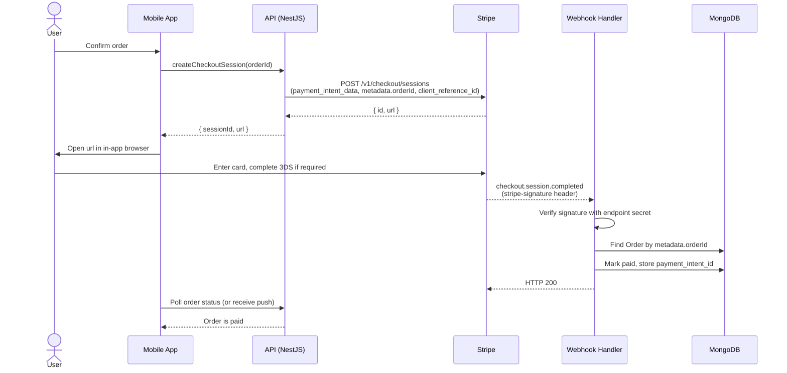

# Payment Flow

> Personal project, in development. This document describes the payment flow as it's implemented in the private codebase.

## 1. Overview

Payments go through **Stripe Checkout**, with the server as the single source of truth. When a buyer confirms an order, the app asks the API to create a **Checkout Session**. The API calls Stripe's `POST /v1/checkout/sessions`, persists the session reference against the order, and returns a hosted `url`. The app opens that URL in an in-app browser; the buyer enters card details on Stripe's page, including any 3DS challenge. Stripe then fires a **webhook** to the API, which verifies the signature and reconciles the order in MongoDB.

The client never reports payment status. A session that "looks" completed in the browser means nothing until the webhook has been verified and processed. The webhook is the only trusted signal.

## 2. Sequence Diagram

## 3. Idempotency

Payment flows fail in interesting ways: networks retry, users double-tap, webhooks are at-least-once. Idempotency lives at two layers.

- **Client to API.** The app sends an `Idempotency-Key` header on `createCheckoutSession`, derived deterministically from the `orderId`. The API forwards its own idempotency key on the Stripe call. A user who taps "Pay" twice, or an app that retries after a flaky response, still ends up with exactly one Checkout Session and one `url`.
- **Stripe to Webhook.** Each webhook delivery carries a stable event ID (`evt_xxx`). The handler writes that ID into a `processed_event_ids` collection with a **TTL index of 7 days**. If the same event arrives twice, the insert conflicts on the unique key, the handler short-circuits, and returns `200`. Stripe retries for up to 3 days, so 7 days is a comfortable margin without letting the collection grow forever.

## 4. Edge Cases

- **Out-of-order delivery.** `checkout.session.completed` can arrive after `payment_intent.succeeded`, or vice versa. Reconciliation keys on `payment_intent_id`, never on event name ordering.
- **Delayed webhook.** The webhook may take minutes (bank latency, Stripe backlog). The app stays on "processing" — the order is never optimistically flipped to paid based on the browser returning.
- **Invalid signature.** Reject with `HTTP 400` and log the metadata of the attempt (IP, headers). Never invoke business logic. Never log the raw body — an attacker could stuff it with noise, and a legitimate payload could carry PII.
- **User abandons the Stripe page.** No webhook arrives. A scheduled job expires pending orders after a TTL (around 30 minutes). No client-side "cancel" signal is trusted.
- **Card declined.** `payment_intent.payment_failed` fires. I surface a retryable error and keep the order open so the user can try again with a different card.
- **3DS challenge.** Stripe handles the challenge UI. A session can legitimately stay open for several minutes; the server does not time out the Checkout Session on its own.
- **Chargebacks and disputes.** Handled by a separate flow on `charge.dispute.created`, routed to the support workflow rather than the order lifecycle.

## 5. Signature Verification

The webhook route is authenticated by **one mechanism and one only**: the `stripe-signature` header, verified using the endpoint secret through the Stripe SDK's `constructEvent()`. No JWT. No IP allowlist. No shared token in a query string. The signature is the auth.

If verification fails, the handler returns `400` and drops the request immediately. The body is never logged — a failing signature means the payload is untrusted, and untrusted payloads can contain anything. The handler never sees invalid events.

## 6. What I Chose Not To Do

- **No Stripe Connect / destination charges.** Splitting funds across connected accounts adds onboarding, KYC, and reconciliation surface that isn't needed at this stage. A single-account flow is simpler to reason about and to audit.
- **No card data on the server.** PAN, CVC, expiry — none of it touches this infrastructure. The buyer types it into Stripe's hosted page. PCI scope stays minimal by construction.
- **No trust in the client.** The browser returning to a success URL is a UI hint, not a fact. Only the verified webhook mutates order state.
